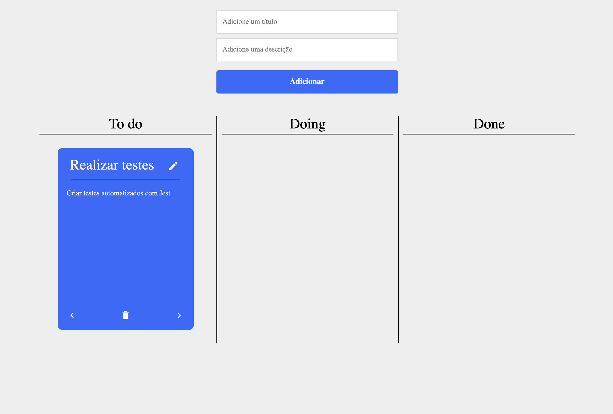

<h1 align="center">
<br>
Lets code Challenge
</h1>

<p align="center">Application built for answer company challenge</p>

<p align="center">
  <a href="https://opensource.org/licenses/MIT">
    
  </a>
</p>

<div>
  
</div>

<hr />

## What was used

- Next.js
- Typescript
- Styled components
- Jest
- Axios
- Clean architecture
- Eslint
- Prettier
- Unform

## Features

- List cards with title and description.
- Create card.
- Update card.
- Delete card.
- Change card status.

## How to download dependencies

```
  yarn
```


## How to run

First of all, create a file .env.local and copy content in env.local.example adding your own API token.

```
  yarn dev
```

## How to execute tests

```
  yarn test
```

## License

This project is licensed under the MIT License - see the [LICENSE](https://opensource.org/licenses/MIT) page for details.

---

Created with passion by me 👨🏻‍💻
